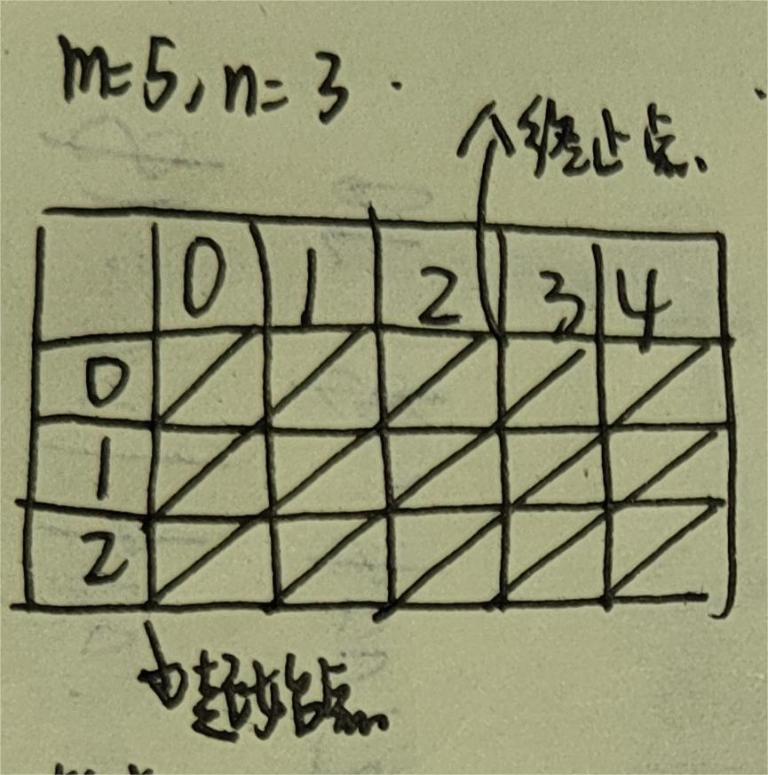

# PLCS

**项目目标：**

* 实现最长公共子序列算法的并行化

## 最长公共子序列

*Longest Common Subsequence LCS*

“最长公共子序列” (Longest Common Subsequence, LCS) 是大家熟悉的算法问题，问题的定义如下：

给定两个字符串 $A$ 和 $B$，现在允许从 $A$ 和$B$中分别删除任意数量的字符，但字符的出现的顺序不能改变，得到字符串  $A^\prime$ 和 $B^\prime$。问如何删除，使得：

- $C=A^\prime = B ^\prime$，即删除剩下的字符串相同，$C$被称为 $A$  和$B$ 的一个 “公共子序列”；
- $|C|$ 即公共子序列的长度最大。

以下是一些例子：

- `LCS("abcde", "ace") = 3`, LCS 为 `ace`
- `LCS("bcdaacd", "acdbac") = 4`, LCS 为 `cdac`
- `LCS("abc", "def") = 0`
- `LCS(“AGGTAB”, “GXTXAYB”) = 4`

[求解方法](https://www.geeksforgeeks.org/longest-common-subsequence-dp-4/)

## 并行化

### 并行的框架

想法：利用条件变量进行同步操作

核心代码：

```c
struct job *job;
mutex_lock(&mutex);
while (! (job = get_job()) ) {  // 如果没有获得到job，就会进行等待
    wait(&cv, &mutex);
}
mutex_unlock(&mutex);
```

较为完整的代码：

```c
typedef struct job
{
  void (*run)(void *arg);
  void *arg;
} job;

void Tworker(int id) {
  if(id == 1)
  {
    // 其中一个线程负责串行逻辑，也就是任务分配
    for (int round = 0; round < 2 * n - 1; round++) {
      // 1. 计算出本轮能够计算的单元格
      // 2. 将任务分配给线程执行
      mutex_lock(&mutex);
      cond_broadcast(&cv); // 通知其他线程执行任务
      // 3. 等待线程执行完毕
      while (!(job_list.job_todo == 0))
      {
        cond_wait(&cv, &mutex);
      }
      assert(job_list.job_todo == 0);
      mutex_unlock(&mutex);
    }
    return;
  }
  
  while (1)
  {
    struct job *work;
    mutex_lock(&mutex);
    while (!((work = get_job()) || all_done))
    { // 如果没有获得到job，就会进行等待
      cond_wait(&cv, &mutex);
    }
    mutex_unlock(&mutex);
    if (!work) break; // 因为是通过all_done条件退出的，所以该线程需要退出
    // 得到了job，就会在没有锁的时候去执行它
    work->run(work->arg);
    release_job(&work); // 注意回收 work 分配的资源
    assert(work == NULL);
  }
}
  
```

> 一个误区：并不是在线性的执行流程中平均分配好任务给各个线程，而是各个线程抢夺我的job

---

**备注：万能的条件变量模板**

```c
WAIT UNTIL(cond) with (mutex) {
    // cond条件在此成立
    assert(cond);
    work();
}
```

```c
lock(mutex);
	while(!cond)
        wait(cv, mutex);
	assert(cond);
	// job();
	broadcast(cv);
unlock(mutex);
```

### 哪些计算可以并行

我们可以把 LCS 的动态规划算法 (无论是递归求解，还是迭代求解) 都看成是一个有向无环图上的计算：为了得到$f(i,j)$的值，我们就需要$f(i-1, j)$、$f(i, j-1)$和$f(i-1, j-1)$的值。只有在这三个值都被正确计算的前提下，我们才能正确计算$f(i,j)$：


很自然地，我们选择用任何 “计算图” 上的拓扑序计算，就可以保证每个节点计算时，它需要的数据都已经准备好，于是有了框架代码中的二重循环，它代表了一种拓扑顺序：

```c
for (int i = 0; i < N; i++) {
  for (int j = 0; j < M; j++) {
    // Always try to make DP code more readable
    int skip_a = DP(i - 1, j);
    int skip_b = DP(i, j - 1);
    int take_both = DP(i - 1, j - 1) + (A[i] == B[j]);
    dp[i][j] = MAX3(skip_a, skip_b, take_both);
  }
}
```

然而，里层循环却不能被直接并行：当$i$固定时，计算$f(i,j)$需要$f(i, j-1)$的值。那么，应该按照什么样的顺序计算呢？不妨把矩形旋转 45 度——你会发现，我们可以在$2n-1$ “步” 之内计算完所有节点上的数值，而每一步里的节点都是可以并行计算的：


在这张图中，只要红线 “上面” 的$f(i,j)$都被正确计算出来，红线上的$f(i,j)$就可以并行计算。当字符串长度足够时，每个线程就可以分配到足够的工作量了。

**关于工作量的变化：**


轮数：$m+n-1$

* 推导，逐个起始点看过来，你可以发现，就是先沿着列逐个往下走，然后沿着行逐个往右走

初始状态：

* 起始点：$(0,0)$
* 终止点：$(0,0)$

随着轮数增加：

```c
if(start.x < n-1) start.x++;
else start.y++;

if(end.y < m-1) end.y++;
else end.x++;
```

当前轮需要进行几次dp计算：

* 可以发现，斜线形成的一定是一个正方形
* 那么就是正方形的边长了，也就是$start.x - end.x + 1$

举个例子：

* 假设两个输入的字符串分别为`1234`和`123`
* 那么中间的dp计算点就是这样子的

```
str1: 1234; str2: 123
start: 0, 0; end: 0, 0; point_num: 1
	i: 0, j: 0, skip_a: 0, skip_b: 0, take_both: 1
start: 1, 0; end: 0, 1; point_num: 2
    i: 1, j: 0, skip_a: 1, skip_b: 0, take_both: 0
    i: 0, j: 1, skip_a: 0, skip_b: 1, take_both: 0
start: 2, 0; end: 0, 2; point_num: 3
    i: 2, j: 0, skip_a: 1, skip_b: 0, take_both: 0
    i: 1, j: 1, skip_a: 1, skip_b: 1, take_both: 2
    i: 0, j: 2, skip_a: 0, skip_b: 1, take_both: 0
start: 3, 0; end: 1, 2; point_num: 3
    i: 3, j: 0, skip_a: 1, skip_b: 0, take_both: 0
    i: 2, j: 1, skip_a: 2, skip_b: 1, take_both: 1
    i: 1, j: 2, skip_a: 1, skip_b: 2, take_both: 1
start: 3, 1; end: 2, 2; point_num: 2
    i: 3, j: 1, skip_a: 2, skip_b: 1, take_both: 1
    i: 2, j: 2, skip_a: 2, skip_b: 2, take_both: 3
start: 3, 2; end: 3, 2; point_num: 1
    i: 3, j: 2, skip_a: 3, skip_b: 2, take_both: 2
3
```


